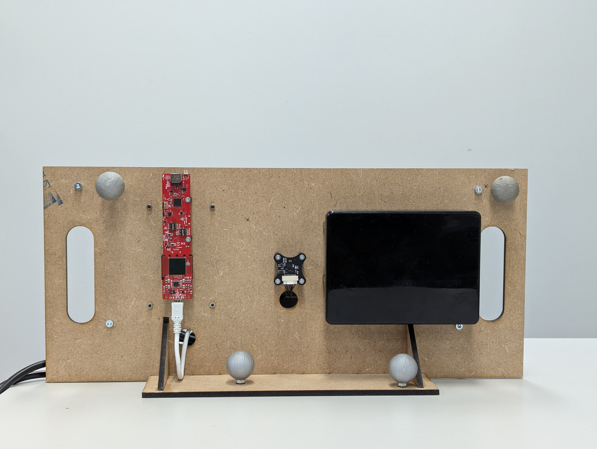
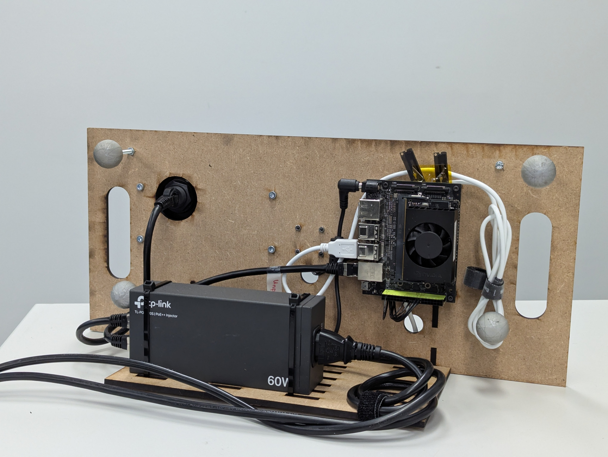

<p float="left">
    
    
</p>

# Radar Rig for data collection to compare radar sensors TIAWR1843AOP with ZadarLabs ZPrime
_Nvidia Jetson credentials: username/password is radar/radar and can be found at 10.10.10.241 in the flynet-an network._

This repository provides an overview of the test rig developed. It is a ROS package, including different launch files to take different measurements.


The radar rig shown in the picture has the following sensors;
- Radar: Texas Instruments AWR1843AOP
- Radar: ZadarLabs ZPrime
- IMU: BMI088
- (Markers for VICON system)

# Usage
Either run launch files through the terminal as familiar, or use the web-interface.
Both require users to be logged into the flynet-an WiFi network. Credentials; ask Michael Pantic.

## Terminal
```bash
ssh radar@10.10.10.241:22 # password: radar
# Or 'ssh radar@radar' should work too
# Then run something like
cd ~/catkin_ws
source devel/setup.bash
roslaunch radar_rig_sensor_fusion master.launch
```
## Web interface
The web interface is available at http://radar:5000 or http://10.10.10.241:5000.
Details on web-interface can be found at this [repository](https://github.com/Maexerich/radar_web_app_control).
In essence it provides a GUI to run any launch file within the radar_rig_sensor_fusion package. It also temporarily streams the terminal to the web-interface. Recordings can be started and stopped by the click of a button.

# Installation
This ros package has many requirements, most of them are from ETHZ-ASL.
Clone repositories into the `src` folder of your catkin workspace and then run `catkin build`.

The dependencies are split depending on what should be done with the test rig.

## To collect data using both Radar sensors and IMU:
- https://github.com/ethz-asl/lpp.git
- https://github.com/ethz-asl/mav_sensors_ros.git
- https://github.com/ethz-asl/mav_sensors.git
- https://github.com/maexerich/zadarlabs_arm_ros1.git
- catkin_simple
- glog_catkin
- https://github.com/ethz-asl/ros_vrpn_client.git
- vrpn_catkin

## Additional dependencies to run RIO
- https://github.com/rikba/gtsam_catkin.git (will take a long time to build when running `catkin build`)
- https://github.com/ethz-asl/rio.git


# Launch files
Different launch files were developed for different use cases. Here a quick rundown of the gist of the main launch files:
## master.launch
Records:
- TI Radar
- ZadarLabs Radar
- IMU
- VICON ground-truth 6DOF pose
Purpose:
Collection of data to compare the two radar sensors or evaluate new algorithms, sensor fusion with IMU is also a possibility.

**Important:** `z_flip` is set to true by default, e.g. the coordinate frame of the TI is *right-handed*. Please refer to the picture in the section [Flip Sign of Z for TI](#flip-sign-of-z-for-ti) for more information.
Disabling this parameter will result in the rigid body transformation as defined to be invalid!


# Notes on different sensors
## Flip Sign of Z for TI
The TI sensor outputs data in a Left-Handed coordinate system. A new variable `flip_z` (boolean) is introduced, which makes the coordinate frame right-handed.
> **Attention:** the original implementation of [RIO](https://github.com/ethz-asl/rio?tab=readme-ov-file) takes the original TIAWR1843AOP LH coordinate frame and considers this in the factor graph.


## ZadarLabs ZPrime
For details on implementation, refer to ROS package [zadarlabs_arm_ros1](https://github.com/Maexerich/zadarlabs_arm_ros1).
That repository contains more than just a 'ROS-interface', but also documentation, drivers, and email conversations with ZadarLabs.

# Coordinate Frames
The following image depicts the coordinate frames of the IMU, TI and ZadarLabs radar sensor.
This is for the configuration `z_flip = true`.

# Datasets
% TODO %
# Evaluation
% TODO %